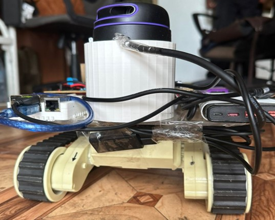
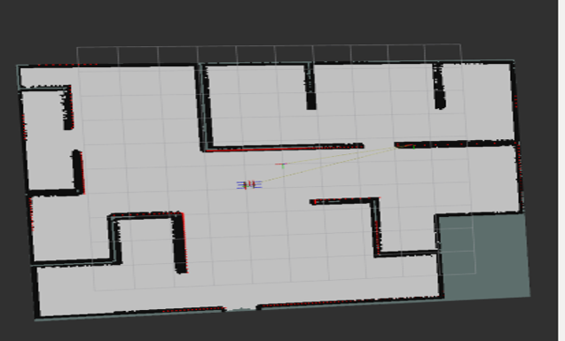
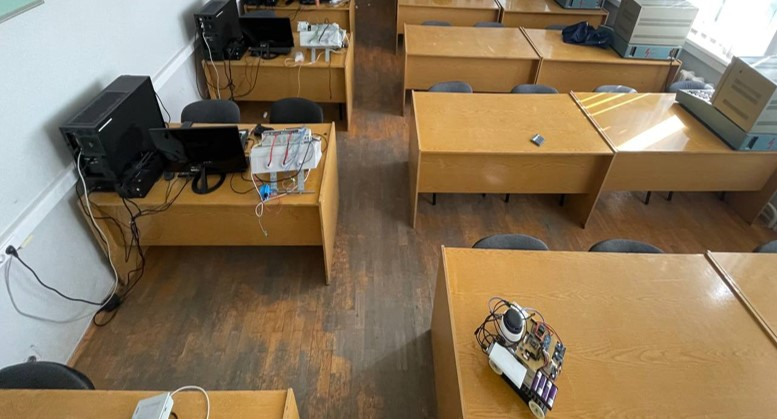
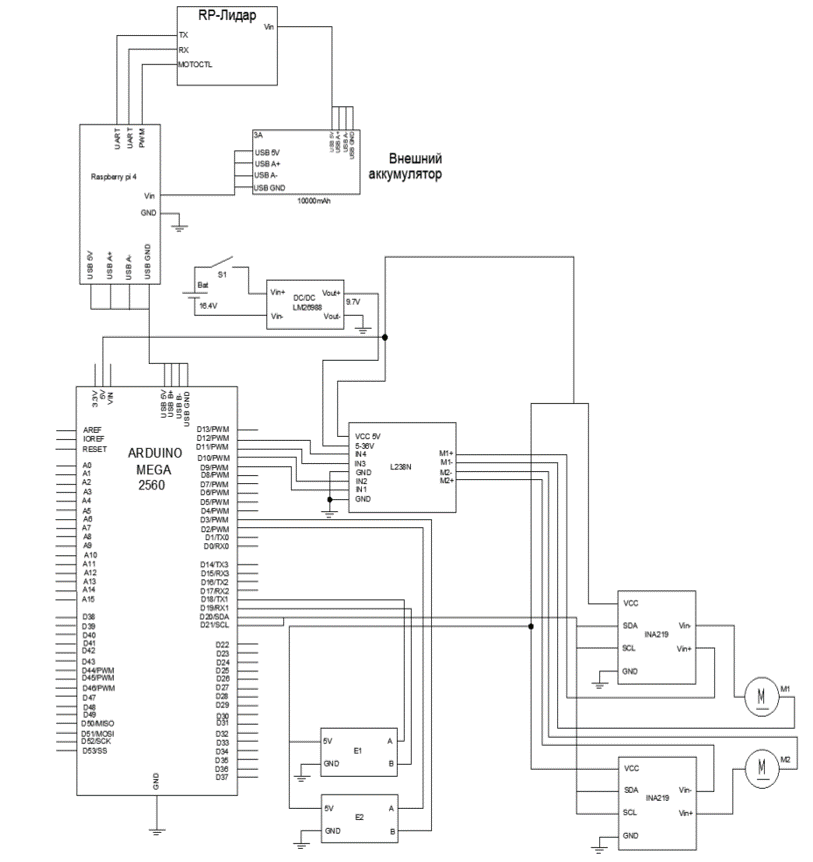
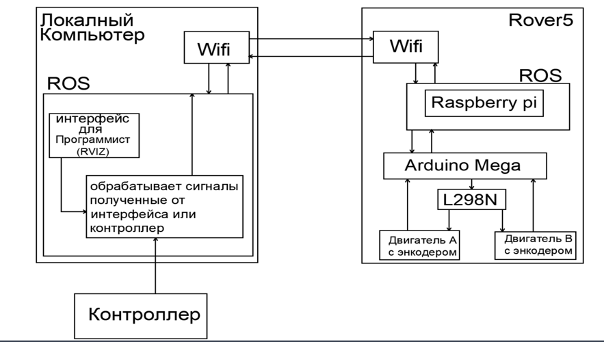

# **Autonomous Robot for Navigation and Obstacle Avoidance Using ROS2**

**Project Overview**:  
This project demonstrates the development of an autonomous robot capable of navigating through a given environment while avoiding obstacles. It combines simulation with ROS2, hardware implementation using Raspberry Pi and Arduino, and real-world tests. The project showcases the full communication between multiple components, both in software and hardware.

---

## **Table of Contents**

1. [Introduction](#introduction)
2. [Features](#features)
3. [System Architecture](#system-architecture)
4. [Hardware Setup](#hardware-setup)
5. [Software Components](#software-components)
6. [Installation Guide](#installation-guide)
7. [Usage](#usage)
8. [Simulation and Real-World Results](#simulation-and-real-world-results)
9. [Schematic Diagrams and Communication Flow](#schematic-diagrams-and-communication-flow)
10. [Testing](#testing)
11. [Acknowledgements](#acknowledgements)

---

## **1. Introduction**

This project focuses on designing and implementing an autonomous robot for navigation in unknown environments. The project leverages ROS2 for control and path planning, while the Raspberry Pi manages sensor data, and the Arduino controls the motor drivers. The aim is to have the robot navigate using real-time data from LiDAR for obstacle detection and encoder for odometry.

**_View of the robot_**:  


The project was divided into two phases:

1. **Simulation**: Using Gazebo and RViz for testing the navigation algorithms.
2. **Real-World Implementation**: Developing and testing the physical robot.

---

## **2. Features**

- **Autonomous Navigation**: The robot can autonomously navigate while avoiding obstacles.
- **Sensor Fusion**: Data from LiDAR are processed in real-time to aid navigation.
- **ROS2 Integration**: ROS2 nodes handle the robot's communication, path planning, and sensor processing.
- **Simulation**: The environment was simulated in Gazebo and visualized using RViz.
- **Real-World Testing**: The robot was tested in various environments to validate the simulation results.

---

## **3. System Architecture**

### **3.1 Theoretical Knowledge:**

The system is designed to follow a modular architecture where the processing of sensor data and control algorithms is split across different nodes in ROS2. The path planning algorithm uses a combination of A\* and sensor data for real-time decision-making.

### **3.2 Practical Implementation:**

The system consists of:

- **Raspberry Pi**: Acts as the brain, running ROS2 and processing sensor data.
- **Arduino**: Controls the motor drivers and handles the low-level motor commands.
- **Local Computer**: Used for simulations, running Gazebo and RViz.

---

## **4. Hardware Setup**

### **4.1 Components:**

- **Microcontroller**: Raspberry Pi 4, handling high-level operations.
- **Motor Controller**: Arduino Mega 2560 for controlling motor drivers.
- **Motors**: DC motors with encoders for precise control.
- **Sensors**:
  - LiDAR: For distance measurement and obstacle detection.
  - Encoders: For Odometry.

### **4.2 Assembly:**

The robot chassis was built to house all components, including 4 Li-ion of 16.8V battery, 9.7V for powering the motors and the rest to power the motor driver. 5V from a power-bank to power the raspberry pi 4 and the lidar.

---

## **5. Software Components**

- **ROS2 Humble**: The middleware for communication between sensors and motor controllers.
- **Gazebo**: For simulating the environment.
- **RViz**: For visualizing the robot’s sensors and movements.
- **Python and C++**: Used for writing control nodes and processing sensor data.
- **Libraries**:
  - `ros2_control`
  - `geometry_msgs`
  - `sensor_msgs`
  - `teleop_twist_joy`
  - `ros-humble-navigation2`
  - `slam_toolbox`

---

## **6. Installation Guide**

### **6.1 Prerequisites**

Ensure that you have the following installed:

- **Ubuntu 20.04** with ROS2 Humble
- Python 3.7
- Git

### **6.2 Steps**

1. **Clone the Repository**:

   ```bash
   git clone https://github.com/codeflamer/rover.git
   cd rover
   ```

2. **Install ROS2 Dependencies**:

   ```bash
   sudo apt update
   sudo apt install ros-humble-desktop python3-argcomplete
   ```

3. **Build the ROS2 Workspace**:
   ```bash
   colcon build
   ```

---

## **7. Usage**

### **7.1 Simulation**

To run the simulation in Gazebo:

```bash
ros2 launch rover launch_sim.py
```

### **7.2 Real-World Implementation**

1. Power up the robot and ensure the Raspberry Pi is connected.
2. Ensure the arduino is properly connected to the raspberrypi for effective communication.
3. Run the ROS2 nodes:
   ```bash
   ssh pi@192.168.199.235
   ros2 launch rover rplidar.launch.py
   ros2 launch rover launch_robot.launch.py
   cd worlds && ros2 run nav2_map_server map_saver_cli -f front-room.yaml
   ros2 launch rover navigation_launch.py use_sim_time:=false map_subscribe_transcient_local:=true
   ```

---

## **8. Simulation and Real-World Results**

### **8.1 Simulation Results**

Below are images and a video showcasing the robot navigating in a simulated environment:

**MAP of the indoor environment obtained using slam_toolbox**:  


**Simulation Video**:  


### **8.2 Real-World Testing**

The real-world tests demonstrated the robot successfully navigating through obstacles in various environments:

**PICTURE OF INDOOR ENVIROMNENT**:  


**SLAM for map construction**:  


**Real-World Result Video**:  


---

## **9. Schematic Diagrams and Communication Flow**

### **9.1 Hardware Schematic**

Below is a diagram of the hardware setup showing connections between the Raspberry Pi, Arduino, motors, and encoder:

**Hardware Schematic**:  


### **9.2 Communication Flow**

This diagram illustrates the communication flow between the Raspberry Pi, Arduino, and the local computer:

**Communication Flow Diagram**:  


---

## **10. Testing**

- **Simulation**: Tested with varying path planning strategies.
- **Real-World Tests**: Conducted tests in only indoor environments.

## **11. Acknowledgements**

Special thanks to:

- The ROS2 community for excellent documentation and resources.
- Gazebo developers for their simulation environment.
- Articulated Robotics
